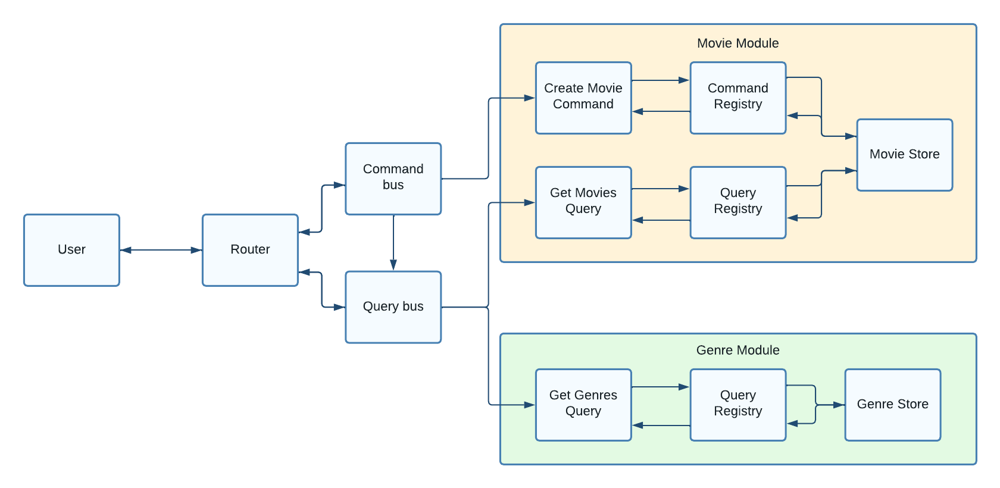

# Movies API



## Environment variables

1. `PORT` - exposed API port
2. `DB_GENRE_FILE_PATH` - path to the genre database file _(relative to the project root directory)_
3. `DB_MOVIE_FILE_PATH` - path to the movie database file _(relative to the project root directory)_

## Project setup

1. Run `yarn` to install dependencies

2. Create a `.env` file in the project root directory

3. Copy data from the `.env.template` file into the newly created `.env` file _(fill empty fields and make some changes if necessary)_

4. Create a `db.json` file inside the `database` directory

5. Copy data from `db-empty.json` or _(if you need some initial data)_ `db-init.json` into the `db.json` file

6. You are ready to go! Run `yarn dev` to start the development server or `docker-compose up` _(if you are using docker)_

## Build project

1. Run `yarn build` and that's it!

2. You can run the project by running the `yarn start` command

## Endpoints

### Create movie

**Method**: `POST`

**Url**: `/movie`

**Body**:

```typescript
class CreateMovieDto {
  title: string // Max 255 characters long
  year: number
  runtime: number
  genres: string[]
  director: string // Max 255 characters long
  actors?: string
  plot?: string
  posterUrl?: string
}
```

**Response**:

```typescript
{
  id: number
  title: string
  year: number
  runtime: number
  genres: string[]
  director: string
  actors?: string
  plot?: string
  posterUrl?: string
}
```

### Get movies

**Method**: `GET`

**Url**: `/movie`

**Query**:

```typescript
{
  duration?: number
  genres?: string[]
}
```

**Response**:

```typescript
{
  id: number
  title: string
  year: number
  runtime: number
  genres: string[]
  director: string
  actors?: string
  plot?: string
  posterUrl?: string
}[]
```
